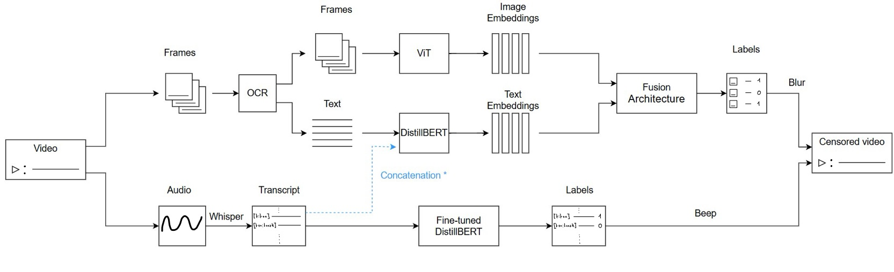

# NoHateZone

NoHateZone is a multi-modal deep learning framework that detects and censors hateful segments in videos. It combines audio, image, and text analysis using advanced transformer-based models to identify and censor hate speech at the segment level, rather than simply classifying entire videos as hateful or not. The censored output video replaces hateful audio with beep sounds and applies blur over hateful visual frames.


## Project Overview

### Pipeline Architecture
<p align="center">
  
  <br>
  <em>Figure 1: End-to-end NoHateZone pipeline.</em>
</p>

Our multimodal hate detection system combines state-of-the-art models:

- **Speech Processing:**
  - `whisper-large-v3-turbo` for audio transcription
  - `distilbert-base-uncased` for text-based hate speech detection

- **Visual Processing:**
  - `GOT-OCR2_0` for text extraction from video frames
  - `vit-base-patch16-224` for image feature extraction

- **Fusion Models:**
  - `SCMA`: Single Cross-Modal Attention
  - `DCMA`: Dual Cross-Modal Attention

The system processes both visual and auditory content simultaneously, with our fusion models combining these modalities for robust hate content detection.

### Key Features
- Real-time processing capability
- Frame-level hate detection precision
- Context-aware multi-modal fusion
- Non-destructive censorship (preserves non-hate content)

## Datasets

1. **[HateSpeechDataset](https://www.kaggle.com/datasets/waalbannyantudre/hate-speech-detection-curated-dataset)**  
   Used for fine-tuning the DistilBERT classifier for audio speech hate detection.

2. **[HateMM Dataset](https://zenodo.org/records/7799469) (re-annotated)**  
   Multi-modal dataset of hateful and non-hateful videos. Re-annotated with refined time intervals and modality-specific labels. We provide our annotations file in `data/HateMM` directory.


3. **[MMHS150K](https://www.kaggle.com/datasets/victorcallejasf/multimodal-hate-speech)**  
   Meme-based dataset used to pre-train fusion models combining tweet texts and images/memes.

## How to Run the Pipeline

To reproduce our results and test the pipeline, follow these steps:

1. **Build Environment:** Use the provided `Dockerfile` and `requirements.txt` to build the container:
    ```bash
    docker build -t nohatezone .
    ```

2. **Prepare Datasets:** Download and extract datasets into the following structure:
    ```
    data/
    ├── HateMM/
    ├── HateSpeechDataset/
    └── MMHS150K/
    ```

3. **Generate Embeddings:** Run the scripts in `src/embedding/` to generate and save .pkl embeddings.

4. **Train Models:** Use the following commands to train:
    ```bash
    python3 src/train.py --model bert             # First: Finetuning DistilBERT on HateSpeechDataset
    python3 src/train.py --model pretrain_fusion  # Second: Pretraining DCMA on MMHS150K
    python3 src/train.py --model finetune_fusion  # Third: Finetuning DCMA on HateMM
    ```
    Models are saved under `/checkpoints`.
    Place fusion_data.pkl under the `/results` folder, then follow the following commands to train:
    ```bash
    python3 training/fusion_archv3.py
    ```

6. **Run Inference:** Place a video at `media/input/video/video.mp4` and run:
    ```bash
    python3 src/main.py
    ```
    The censored output appears in `media/output/video/`.

## File Structure
```text
├── README.md
│
├── data/
│   ├── HateMM/
│   │   └── HateMM_annotation_adjusted.xlsx: is the updated HateMM data including the modality-specific labels
│   ├── HateSpeechDataset
│   │   └── Includes the HateSpeechDataset
│   └── MMHS150K/
│       └── Includes memes data and corresponding embeddings       
│
│
├── main_process/
│   ├── frame_audio_decomposer.py: decomposes the video into audio chunks and frames extracted per second
│   │    
│   ├── audio2text.py & utils.py: includes helper functions and model imports
│   │   
│   ├── chunk_frame_generator.py: generates the frames with 1-second frequency and extracts the corresponding texts using OCR
│   │
│   ├── chunk_labeller_with_intervals.ipynb: gets the data ready to acquire the performance metrics for our fine-tuned DistillBERT (DBertXhate)
│   │
│   └── .csv and .xslx files: intermediary files to get the embeddings for model training
│
│
├── src/
│   ├── embedding/
│   │   ├── audio_image_combiner.ipnyb: selects a random image given the audio chunk intervals
│   │   │
│   │   └── other .py files: get the embeddings (dim=768) for HateMM and MMHS150K using our ViT and DistillBERT
│   │
│   ├── models/   
│   │   ├── crossval_model.py: Modular script used to find the best architecture for DCMA using cross-validation
│   │   │
│   │   └── fusion_model.py: DCMA Final Architecture
│   │
│   ├── tests/ Some tests performed 
│   │
│   ├── train/
│   │   ├── bert_finetune.py: training file for DistillBERT fine-tuning using the HateSpeechDataset for detecting hate in audio transcriptions
│   │   │
│   │   ├── crossval_train.py: Script for running crossval DCMA model to identify best parameters and architecture.
│   │   │
│   │   ├── fine_tune_SCMA.py: SCMA fusion architecture fine-tuned on HateMM data (audio + image + OCR text)
│   │   │
│   │   ├── finetune_fusion.py: DCMA fusion architecture fine-tuned on HateMM data (image + OCR text)
│   │   │
│   │   ├── fusion_arch_v3.py: SCMA fusion architecture pre-trained on memes dataset (MMHS150K)
│   │   │
│   │   ├── train_fusion.py: DCMA fusion architecture pre-trained on memes dataset (MMHS150K)
│   │   │
│   │   └── random_classifier.py: Random classifier tested on HateMM data (image + OCR text)
│   │   
│   │     
│   ├── evaluation/
│   │   ├── SCMA_fine-tune_results/
│   │   │   ├── result_analyzer.py: calcualtes the standard deviation of the metrics in text_metrics.csv
│   │   │   │  
│   │   │   └── test_metrics.csv and roc_per_seed.png: results of SCMA fine-tuning 
│   │   ├── SCMA_fine-tune_results/
│   │   │   └── results of SCMA pre-training
│   │   │
│   │   └── other .py files for evaluation purposes
│   │
│   └── utils/
│       └── includes the helper functions
│
│
├── media/
│   ├── 'input/video'/
│   │    └── includes the input video for inference
│   └── 'output/video'/
│       └── includes the final generated censored video  
│
│
└── submission/
    └── includes the necessary files for project submission
```

## Contact 
For questions or issues, feel free to open a GitHub issue or reach out to any of the project contributors.
